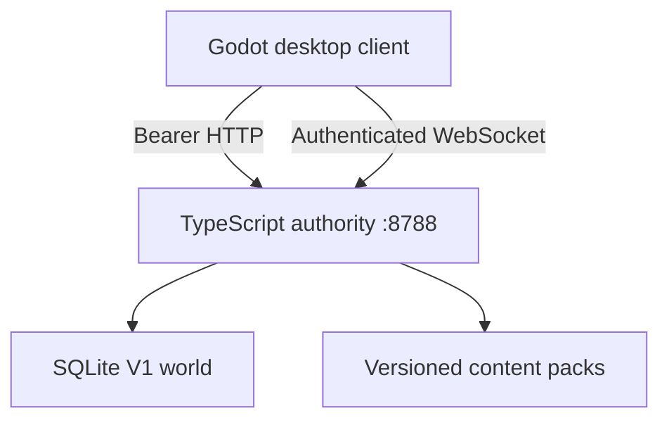

# Rush & Revenue Online

Rush & Revenue Online is a native top-down restaurant MMORPG foundation: players choose a country and region, join persistent public restaurant shifts as one of seven hospitality classes, visit as a paying guest, or found and physically design a restaurant.

This repository is the clean `rro.v1` line. It contains a Godot 4 client, a strict TypeScript authoritative server, the launch gameplay/content definitions, local authentication and SQLite persistence, Windows server controls, tests, release tooling, the comprehensive design document, a measured art-production queue, and a 240-item V2 AAA backlog.

The version is `1.0.0-alpha.2`. The source baseline is functional and tested; it is not represented as a finished, operated AAA MMO. Godot 4.4.1 now imports the project and launches the main scene cleanly on Linux. The supplied release tool still emits a client **source** ZIP unless a real Godot Windows export exists; the tagged GitHub workflow installs pinned export templates and builds the native Windows client.

Alpha 2 is the production-foundation pass: furniture is now a persistent restaurant inventory with non-linear tradeoffs, live performance effects, upkeep, wear, breakage, and repair; every role has a persistent personal-equipment shop/loadout; and local rivals can spend earned cash during a physical guest visit to apply a chosen, bounded minigame modifier with visible counterplay. The catalog has 229 furniture definitions and 45 role-equipment items. Artwork coverage is measured rather than implied: all 16 core furniture pieces and four production-catalog pieces have individual raster sprites, leaving 209 furniture sprites and 45 bespoke equipment icons in the production-art queue.

> **Recovery status (2026-08-02):** this repository is the recoverable Alpha 2 source of truth. A previously reported Alpha 3/full-art checkpoint was never durably delivered and is not part of the product. Current coverage remains 20/229 furniture sprites and 0/45 bespoke equipment icons. See `docs/PRODUCTION_AUDIT_AND_ROADMAP.md` for the verified state and next steps.

## What is implemented

| Area | V1 source baseline |
|---|---|
| World | Native tactical globe; 6 countries, 13 regions, 115 licenses, 23 seeded NPC restaurants; exactly 20% initial occupancy |
| Persistence | New V1 SQLite schema; accounts, sessions, characters, attributes, role progress, personal inventory/loadouts/audits, restaurants, layouts, live shifts, tasks, incidents, reviews, and ledgers |
| Multiplayer | Authenticated WebSocket snapshots/commands, shared live shifts, public employee/guest entry, NPC vacancy coverage, duty handoff, recorded command IDs |
| Roles | Manager, Owner, Server, Dishwasher, Chef, Cook, Host/Busser; 28 skills each (196 total) and independent progression |
| Work | 89 role-authentic activities, four work lanes, three phases per task, controlled/risky choices, 12 animated minigame presentations, off-role penalties |
| Consequences | Late pressure, partial failure, spills, sanitation loss/recovery, party patience/satisfaction, evidence-based reviews, wages and XP |
| Guest competition | Five paid, legitimate requests; manual task target, timing/precision/memory/handoff/interruption dimension, three intensities, caps, telegraphing, and staff counterplay |
| Building | Persistent 24×16 floor, add-ons to 64×64, floor painting, room tags, snapped walls/doors/arches, drag/move, four-way art rotation, collision, resale, wear and repair |
| Furniture economy | 229 persistent items with price, upkeep, repair cost, comfort, appearance, cleanability, reliability, role/service effects, duplicate tapering, wear and breakage |
| Role inventory | 45 persistent purchasable tools/consumables, seven role catalogs, four-slot loadouts, shop/inventory screen, stable icon IDs and procedural icon fallback |
| Art | 20 individual generated top-down raster sprites (16/16 core plus four production items), 10 modular SVG/UI assets; explicit coverage gate reports 209 furniture sprites remaining |
| Extensibility | Versioned packs, stable IDs, content hash, role inheritance hooks, seasonal events/modifiers, generated typed server content |
| Operations | Hidden Windows server start, health polling, graceful tokenized stop, exact-PID fallback, separate server/client/source artifacts |
| Verification | Strict TypeScript, zero-error/zero-warning Godot analysis, native Godot 4.4.1 import/launch/export, data invariants, and 29 server/integration tests |

## Runtime architecture



The client sends intent: movement vectors, task claims, phase choices, layout mutations, and guest requests. The server owns time, collision, task state, outcome scores, money, progression, parties, NPC coverage, incidents, reviews, and persistence.

There is no browser gameplay runtime, compatibility facade, V0 database migration, or client-submitted final score in the V1 release line.

## Player installation on Windows

The game and server are intentionally separate distributions.

### Persistent local server

1. Extract `RRO-Standalone-Server-<version>-windows-x64.zip` to a normal writable folder.
2. Double-click **RRO Server Control.hta**.
3. Select **Start server**. The pinned runtime starts hidden; no command prompt remains open.
4. Use **Stop gracefully** before moving, replacing, or deleting the server folder.

World data lives in `data\rro-v1.sqlite`. Back up the whole `data` folder only while the server is stopped. The controller first uses the loopback-only graceful shutdown API; an exact-PID kill is only a fallback when that API is unreachable.

### Native client

1. Extract `RRO-Game-Client-<version>-windows-x64.zip` separately.
2. Keep the local server running.
3. Double-click **Rush and Revenue Launcher.hta**, then select **Play**.
4. Create an account or log in on the native client screen; it connects to `http://127.0.0.1:8788`.

If an archive is named `RRO-Godot-Client-Source-…`, it is intentionally a developer source package, not a disguised executable. Export it with Godot 4.4.1+ or download a tagged CI release containing the real game-client ZIP.

## Controls

| Context | Input |
|---|---|
| Restaurant movement | WASD or arrow keys |
| Zoom | Mouse wheel |
| Camera pan | Middle-button drag |
| Select/place/paint | Left click or left drag |
| Move furniture | Pointer tool, drag the placed object |
| Rotate | Right click or `R` |
| Task play | Claim owned work, then resolve each displayed phase action |
| Exit | **Leave shift** returns the duty to NPC coverage; **Quit** closes the client |

The native client does not expose a browser context menu and cannot drag the whole application page. Pan, paint, placement, drag, and rotation are scoped to the restaurant canvas.

## Developer quick start

Requirements:

- Node.js 24 or newer;
- npm;
- Godot 4.4.1 or newer for running/exporting the client;
- Windows export templates for a Windows game build.

```bash
npm ci
npm run verify
npm run dev:server
```

Open `apps/client-godot/project.godot` in Godot and run the main scene. The client defaults to `http://127.0.0.1:8788`.

Command-line startup is a developer workflow, not the player distribution. The standalone Windows server ZIP uses the control application; the exported game ZIP uses the native launcher.

Useful commands:

| Command | Purpose |
|---|---|
| `npm run generate:data` | Rebuild 196 skills, 89 activities, construction, appearance, and 210 production furniture definitions |
| `npm run generate:art` | Rebuild the 229-furniture/45-item artwork queue with stable output paths, prompt briefs and live coverage status |
| `npm run generate:backlog` | Rebuild the 240-task JSON/Markdown V2 backlog |
| `npm run validate:data` | Assert content references, timing, rotation, and exact 20% world seeding |
| `npm run validate:godot` | Parse/type-analyze every GDScript; enforce modular assets, core sprites, honest art coverage, and no baked backgrounds |
| `npm run typecheck` | Strict-check the TypeScript server |
| `npm test` | Build and run integration tests |
| `npm run verify` | Run every release gate available without a Godot runtime |
| `npm run smoke:server` | Start a temporary V1 world, verify health, request graceful shutdown, and prove marker cleanup |
| `npm run release` | Verify and emit separate server, source, planning, and native/source-client artifacts |

`npm run release` pins and verifies a Windows Node 24.14.0 runtime for the standalone server. It only emits `RRO-Game-Client-…` when `apps/client-godot/build/windows/Rush & Revenue Online.exe` is a real export. Otherwise it emits a clearly labeled client-source archive.

## Repository map

```text
apps/
  client-godot/       Native game client, modular SVG/PNG assets, export preset
  server/             Strict TypeScript API, simulation, persistence, realtime
packages/game-data/   Core and seasonal versioned content packs
config/               V1 server configuration
launchers/windows-v1/ Hidden start/stop, server controller, client launcher
tests/                 Content, builder, live-service, HTTP/WebSocket tests
tools/                 Data, backlog, validation, and release generators
planning/              Issue-tracker-ready V2 backlog and deterministic art queue
docs/                  GDD, architecture, runbooks, gates, roadmap, backlog
legacy/                Audit-only V0 recovery; excluded from every V1 artifact
```

Nothing under `legacy/` is imported, built, tested, packaged, or supported by V1. It exists only as an internal audit record in this workspace and is excluded from the GitHub source archive generated by the release tool.

## Adding content without hard-coding

Content begins at `packages/game-data/manifest.json`. Enabled packs can contribute furniture and seasonal events today. The role resolver also supports parent-role inheritance so subclass packs can add permissions, tags, attribute weights, skills, and activity ownership without editing a role switch.

For a new furniture pack:

1. create a pack directory and `pack.json`;
2. add `furniture.json` with stable IDs, footprints, price/upkeep/repair, tradeoff stats, role effects, asset IDs, utilities, and tags;
3. add the pack to the manifest;
4. run `npm run validate:data && npm test`.

For a subclass, define a role with `kind: "subclass"` and `parentRoleId`; contribute its skill/activity data through the same compiler path. Persistent records use stable content IDs, not array positions.

## Release truth and roadmap

- [Comprehensive game design document](docs/GAME_DESIGN_DOCUMENT.md)
- [V1 release gate](docs/V1_RELEASE_GATE.md)
- [V2 AAA MoSCoW roadmap](docs/V2_AAA_ROADMAP.md)
- [240-task team backlog](docs/V2_TEAM_BACKLOG.md)
- [Machine-readable backlog](planning/v2-backlog.json)
- [Furniture and role-item art queue](planning/art-production.json)
- [Architecture](docs/ARCHITECTURE.md)
- [Server operations](docs/SERVER_README.md)
- [Native client guide](docs/GAME_README.md)
- [Content packs](docs/CONTENT_PACKS.md)

The V1 gate separates “implemented in source,” “automatically verified,” “requires native runtime verification,” and “requires a staffed production organization.” That boundary is deliberate: a playable vertical slice can be built here; an AAA MMO also requires sustained art, design, security, platform, QA, moderation, SRE, support, and live-content teams.
