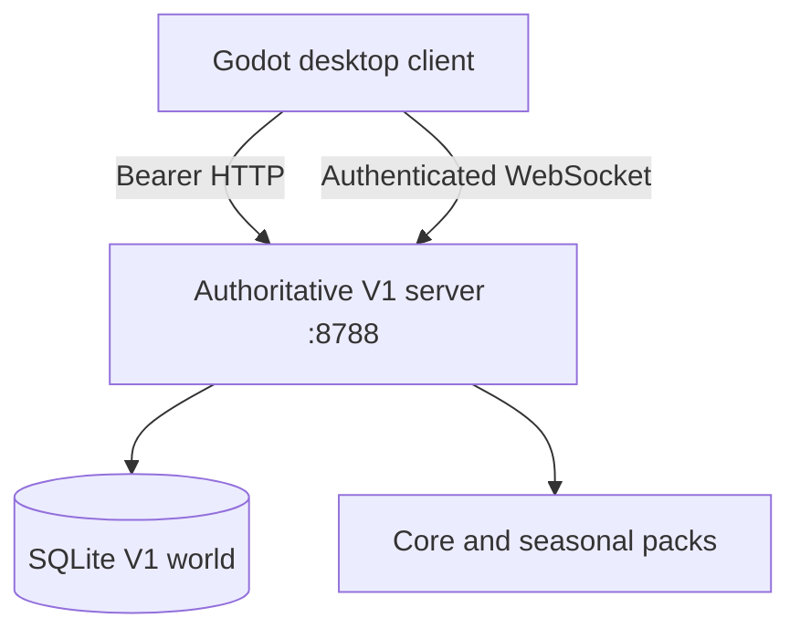

# Runtime architecture

**Baseline:** `1.0.0-alpha.1`  
**Wire contract:** `rro.v1`  
**Persistence schema:** clean V1, schema 1  
**Client engine:** Godot 4.4.1+  
**Server runtime:** Node.js 24 / strict TypeScript / SQLite

This document describes the source that exists now. The team-scale V2 service decomposition is planned in `V2_AAA_ROADMAP.md` and `planning/v2-backlog.json`.

## Product and release boundaries



The client, server, source repository, and production plan are separate artifacts. The standalone server contains no Godot project or client executable. The game-client package contains no server implementation or database. The source archive contains both development trees but excludes the audit-only `legacy/` tree.

V1 deliberately has no V0 database migration, route facade, browser client, or save compatibility. Stable V1 IDs begin a new contract.

## Authority model

The client sends intent and presents results. It owns:

- input, camera, local UI state, rendering, animation, and sound;
- local placement previews and pointer modes;
- the visual grammar for each minigame;
- local session-token storage and reconnect presentation.

The server owns:

- account authentication and session expiry;
- the clock, random outcomes, shift state, and snapshot version;
- character attributes, roles, skills, money, wages, XP, and ledgers;
- restaurant ownership, applications, construction validation, and resale;
- duty slots, NPC coverage, player presence, parties, tasks, and incidents;
- movement bounds, collision, task claims, phase order, scoring, and consequences;
- sanitation, patience, satisfaction, review evidence, reviews, and restaurant ecology.

There is no command that accepts a final player score. A work item is created by the server, claimed by a character, resolved through ordered phase actions, scored by the authority, and recorded under an idempotency key.

## Runtime lifecycle

1. The server loads `config/server.v1.json` and all enabled packs from `packages/game-data/manifest.json`.
2. The content compiler resolves role inheritance, validates the base-role workload, and calculates a SHA-256 content hash.
3. SQLite opens with foreign-key enforcement and WAL. A brand-new V1 world is seeded if absent.
4. World seeding creates 6 countries, 13 regions, 115 restaurant licenses, and exactly 23 NPC restaurants (20%).
5. With `autoOpenNpcShifts`, one public NPC-covered shift opens in each region.
6. The HTTP and WebSocket interfaces listen on loopback by default.
7. Active shifts tick at `tickRate` and publish authoritative snapshots at `snapshotRate`.
8. Graceful shutdown stops accepting commands, closes sockets, stops simulation timers, closes SQLite, and removes the per-run PID/control markers.

## HTTP surface

Public endpoints are intentionally small:

| Method | Route | Purpose |
|---|---|---|
| GET | `/health` | Protocol, schema, content hash, and uptime |
| POST | `/v1/auth/signup` | Create a local account and randomized character |
| POST | `/v1/auth/login` | Create a bearer session |
| GET | `/v1/content/manifest` | Content compatibility metadata |

Authenticated endpoints cover bootstrap, logout, appearance, skill unlocks, world/region browsing, applications, restaurant founding, layouts, shifts, joining, leaving, and snapshots. Mutating routes validate ownership and domain rules server-side.

`POST /v1/local-admin/shutdown` is not a gameplay API. It accepts only loopback requests carrying the random `X-RRO-Control-Token` written for that process under `run/`.

HTTP request bodies are bounded. Authentication tokens are random bearer secrets whose digests—not raw values—are stored in SQLite. Passwords are stored with per-account salted scrypt derivation.

## Realtime contract

The client upgrades at `/v1/realtime`, then sends:

1. `{ "type": "auth", "token": "…" }` within five seconds;
2. `{ "type": "subscribe", "shiftId": "…" }`;
3. command envelopes with a bounded unique ID, shift ID, type, and payload.

Current authoritative command types are:

| Command | Intent |
|---|---|
| `move` | Normalized movement vector; authority applies speed, bounds, and collision |
| `task.claim` | Claim an available task; server marks off-role work and its penalty |
| `task.action` | Choose the next permitted phase action; server scores and propagates effects |
| `guest.challenge` | Purchase a legitimate visible service complication while visiting |

The server emits `ready`, full `snapshot`, `command.ack`, `shift.closed`, and structured `error` messages. Messages are limited to 64 KiB, a connection is limited to 40 incoming messages per second, and heartbeat pings remove dead clients. V1 sends full JSON snapshots; delta encoding, input sequencing, prediction/reconciliation, and reconnect restoration are V2 networking work.

## Simulation model

An open restaurant is a shared crewed system:

- seven role duty slots remain covered by NPC simulation until claimed;
- an employee join transfers a selected slot without resetting the restaurant;
- guests become physical parties and can spend earnings on bounded challenges;
- each role receives work in `now`, `next`, `prevent`, and `admin` lanes;
- every activity has three phases and maps to one of 12 reusable minigame grammars;
- incidents create spatial or operational debt rather than a detached popup;
- shift settlement writes wages, XP, revenue/cost evidence, reviews, and viability effects;
- unsuccessful NPC restaurants can close permanently, and underserved regions can spawn replacements.

The current tick is a production-oriented vertical-slice loop, not a horizontally scalable MMO shard. V2 adds isolated shift workers, regional routing, interest management, deltas, deterministic replay, and hosted datastores.

## Persistence

SQLite tables are grouped by domain:

| Domain | Records |
|---|---|
| Identity | accounts, sessions, characters, character attributes |
| Progression | role progress, skill unlocks |
| World | countries, regions, restaurants, applications |
| Construction | floor cells, wall edges, object instances |
| Live service | shifts, duty slots, presences, parties, tasks, incidents |
| Consequence | review evidence, restaurant reviews, ledger entries |
| Reliability | application metadata, idempotent command log |

The database is a single-player/local-world storage choice. It is not the V2 hosted datastore. V1 production promotion still requires forward migrations, verified backups/restores, corruption repair, retention, and upgrade tests.

## Content architecture

`packages/game-data/manifest.json` selects enabled content packs. The server compiles a single deterministic runtime registry and content hash. Today, enabled packs can contribute furniture and seasonal events; the role resolver supports inheritance for subclasses. Generated core data supplies 196 skill nodes, 89 activities, construction surfaces, avatar palettes, and production furniture.

Stable IDs are persistent references. Pack order must never be used as identity. A content removal that would orphan a saved reference is a schema/content migration and cannot be shipped as a silent deletion.

The V2 content SDK/compiler must add JSON schemas, dependency declarations, generated Godot bindings, asset bundles, localization, entitlement rules, signature verification, activation/rollback, and compatibility windows.

## Modular builder

The restaurant is persisted as simulation primitives, not a background image:

- floor cells include surface and room tag;
- wall-edge records represent walls, doors, and arches;
- object instances reference stable furniture IDs, coordinates, footprint, and one of four rotations;
- the server validates plot bounds, overlap, affordability, ownership, and resale;
- add-ons increase the editable parcel within hard limits.

The Godot canvas provides explicit pointer, floor, wall/opening, object, drag, and rotation modes. Utilities, egress/code compliance, flow heatmaps, undo/history, and multi-user blueprint editing remain V2 work.

## Repository boundaries

```text
apps/client-godot/     Native presentation and interaction client
apps/server/           Authoritative HTTP/WebSocket simulation service
packages/game-data/    Versioned core and seasonal definitions
config/                Runtime configuration
launchers/windows-v1/  Console-free player/server controls
tests/                 Content and server integration coverage
tools/                 Generators, analyzers, and release packaging
planning/              Assignable V2 backlog
docs/                  Design, runbooks, gates, and ADRs
legacy/                Audit-only V0 material; never packaged
```

Dependencies point inward from runtime adapters toward domain code and stable data. The client never reads SQLite. Content code does not call UI code. Layout mutations go through the server. Release tooling treats runtime artifacts as independent products.

## Verification and release

`npm run verify` regenerates deterministic data/backlog outputs, validates game data, runs full GDScript static analysis, strict-checks TypeScript, builds the server, and executes integration tests. CI adds a real headless Godot editor import on Linux and Windows. Tagged release CI installs Windows export templates and exports the native client before packaging.

The local release script refuses to label client source as a runnable game. If a real Godot export is absent, it emits `RRO-Godot-Client-Source-…zip`; only a present export produces `RRO-Game-Client-…zip`.

## V2 evolution rule

V2 replaces deployment topology, not the core hospitality model. Every extracted service must preserve:

- server authority and idempotency;
- evidence-backed money and reviews;
- stable content IDs and explicit migrations;
- one-hour session balance and 4× time;
- NPC-to-player role handoff;
- role responsibility and recoverable failure;
- local-world support through an adapter rather than a second ruleset.

Service-boundary, migration, networking, security, observability, and operations tasks are enumerated in `V2_TEAM_BACKLOG.md`.
