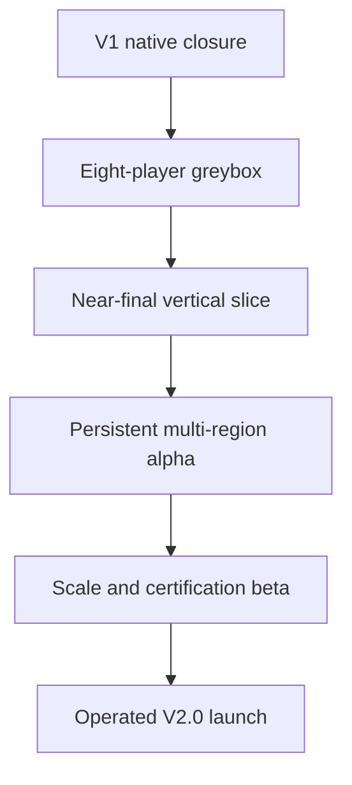

# Production readiness assessment and roadmap index

**Assessment baseline:** `1.0.0-alpha.2`
**Protocol:** clean `rro.v1`  
**Assessment date:** 2026-08-01
**Decision:** verified production-foundation source alpha; not production 1.0; credible native foundation for a staffed V2 program

This file replaces the pre-migration assessment. The React/browser prototype described by older revisions has been retired to the unshipped `legacy/` audit tree. The production gameplay line is now Godot plus an authoritative TypeScript server.

Use the following documents as the current planning set:

| Document | Authority |
|---|---|
| `GAME_DESIGN_DOCUMENT.md` | Comprehensive product, simulation, roles, minigames, world, economy, construction, social, content, UX, and acceptance design |
| `V1_RELEASE_GATE.md` | Evidence-based boundary between implemented, runtime-unverified, and production-required work |
| `V2_AAA_ROADMAP.md` | V2 MoSCoW scope, phases, team topology, and guardrails |
| `V2_TEAM_BACKLOG.md` | Human-readable 240-task development inventory |
| `planning/v2-backlog.json` | Issue-tracker-ready canonical task records with IDs, dependencies, discipline, priority, target, size, and acceptance |
| [`ART_PROGRESS.md`](ART_PROGRESS.md) | Single authoritative generated art-status ledger, including visual QA, runtime binding, remote preservation, CI evidence, blockers, and next work |
| `planning/art-production.json` | Non-authoritative catalog and legacy-reference index; preserved direct-overhead furniture files are explicitly excluded from production completion |
| `ROLE_GAMEPLAY_OPEN_SHIFTS.md` | Detailed crew-workload and drop-in shift design companion |

## Executive assessment

The migration changed the project from a browser systems prototype into a native, server-authoritative vertical-slice foundation. Alpha 2 now demonstrates the defining loops: local identity and persistence, tactical world selection, exactly 20% NPC restaurant seeding, open shared shifts, seven role classes, persistent role equipment, continuous role queues, fallible multi-phase work, targeted local-rival pressure, furniture-driven ratings/economics/wear, causal incidents/reviews, modular construction, seasonal data, randomized aptitude, character colors, and restaurant birth/death.

That is meaningful V1 engineering progress, but “production ready” has three different meanings:

1. **Source alpha ready:** another developer can install dependencies, verify the tree, run the server, open the Godot project, and extend the data. This is the present state when the gate is green.
2. **Native alpha ready:** a real exported Windows client and standalone server have completed the recorded two-client acceptance session. Godot 4.4.1 Linux import/main-scene launch now passes; Windows export and graphical multi-client acceptance remain.
3. **Commercial 1.0 ready:** signed artifacts, updater/installer, migrations/backups, accessibility/localization, security/privacy, anti-abuse, observability/support, platform certification, production content, and sustained QA all exist. This is not the present state.

The repository is intentionally honest about these boundaries. Packaging will emit a source-client archive—not a fake game EXE—when a native export is unavailable.

## Current strengths

| Area | Evidence in V1 |
|---|---|
| Engine boundary | Native Godot 4 project; no browser gameplay or baked restaurant image; 4.4.1 headless import/main-scene launch passes |
| Authority | HTTP/WebSocket service owns task phase/order/outcome, movement collision, money, XP, incidents, reviews, and layouts |
| Persistence | Fresh normalized SQLite line covering identity, personal equipment/loadouts, world, construction, shifts, economy, evidence, and command idempotency |
| Crew fantasy | Employee/guest drop-in, role duty slots, NPC vacancy coverage and handoff, four work lanes |
| Role breadth | Seven roles, 196 skill nodes, 89 authentic activity briefs and 12 minigame grammars |
| Failure | Risk choices, deadlines, off-role penalty, rivalry modifiers, spills, sanitation, patience/satisfaction, equipment condition and evidence-based review effects |
| Furniture economy | 229 non-linear inventory choices feed ratings, happiness, work support, revenue/upkeep, cleaning, wear, breakage and repair |
| Role inventory | 45 purchasable tools/consumables across seven roles, persistent four-slot loadouts and a native inventory/shop screen |
| Rivalry | Same-region physical visits, manual live-task/dimension/intensity selection, spend ledger, telegraphing, cooldown/caps and staff upside |
| Builder | Cell surfaces/rooms, edge walls/openings, instance furniture/decor, rotating art, drag, collision, sale, repair and expansion |
| World ecology | Finite regional capacity/resources, exact 20% NPC opening, closure and replacement generation |
| Extensibility | Stable IDs, manifest packs, content hash, seasonal events, role inheritance hook, generated data |
| Local operation | Separate server/client packages, hidden start, health, tokenized graceful stop, exact-PID fallback |
| Team handoff | Architecture/runbooks/GDD, deterministic generators, one authoritative generated art ledger, strict checks and an assignable backlog |

## Blocking gaps before native V1 promotion

- export and hash the Windows executable using official templates;
- execute start/stop/restart/delete tests on supported Windows versions, including paths with spaces;
- run two concurrent client processes through a complete service and guest visit;
- prove persistence across a client/server restart and safe backup/restore;
- add reconnect ownership restoration and better client prediction before wider multiplayer testing;
- wire more skill effects into live simulation rather than presenting progression data alone;
- connect every role-equipment modifier/consumable to live minigame behavior and add equipment condition;
- complete every unresolved furniture, equipment, construction/world/UI and modular-character lane in the generated [production art ledger](ART_PROGRESS.md), using the elevated orthographic-isometric runtime contract;
- add ingredient lots, tickets, recipes, food safety, utilities, and deeper guest service causality;
- perform a minimum accessibility/input-remapping pass and paid restaurant-role playtests;
- produce complete licenses/SBOM, scan artifacts, and sign any build described as public 1.0.

These gaps are not hidden by renaming the alpha. They are tracked in the V1 gate and V2 task inventory.

## MoSCoW summary

### Must have before commercial V1.0

- native Windows acceptance, signed launcher/client/server, safe install/update/uninstall;
- forward-only database/content migrations, automated backup and restore drills;
- reconnect, input sequencing, bounded prediction/reconciliation, and multiplayer soak;
- complete one-party service causality across host, server, cook/chef, dish, manager, and owner evidence;
- execution of role skill effects and a minimum authentic full-shift workload for all seven roles;
- accessibility baseline, remapping, text scaling, non-color cues, timing alternatives, and tested settings persistence;
- threat model, authorization review, dependency/SBOM/license pipeline, privacy posture, abuse controls;
- crashes/logging/metrics/support diagnostics and documented rollback;
- external restaurant-veteran and MMO-crew acceptance evidence.

### Should have shortly after V1.0

- richer avatar parts and eight-way role animations;
- recipes, lot-level inventory, product rotation, ticket rail, maintenance, inspections, and real paperwork variants;
- utilities/code/flow validation, undo, templates, and collaborative design proposals;
- subclass launch set and production furniture/restaurant concept packs;
- friends/crews, shift finder, mentorship, consented guest challenge tiers, and moderation cases;
- broader regions and culturally reviewed restaurant formats;
- event calendar/activation/rollback and live balance tooling.

### Could have after the core is stable

- curated blueprint sharing, spectator/replay teaching, restaurant leagues;
- companion scheduling/purchasing views;
- private training worlds and hospitality-school scenarios;
- creator cosmetic construction packs with curation and licensing;
- advanced procedural parcels and neighborhood evolution.

### Won’t have in the clean line

- V0 browser/save/route compatibility;
- client-submitted scores or client authority over economy/reviews;
- arbitrary customer sabotage, fake-allergy griefing, vandalism, or unearned reviews;
- pay-to-win role stats, loot boxes, blockchain, NFTs, or cash-out currency;
- forced four-hour sessions;
- unsafe restaurant practices rewarded as optimal play.

## V2 program shape

V2 is not “more UI on V1.” It is the team-scale program that turns a local vertical slice into an AAA MMO:

The 240-task backlog is divided across 28 categories, including production, architecture, networking, data, simulation, each restaurant role, minigames, builder, economy/logistics, NPC ecology, social/PvP, live content, client, art, audio, accessibility/localization, platform, security, QA, analytics, and SRE.

Every task has a stable assignable ID. XL work must be decomposed before sprint commitment. A task is not done because code exists; its acceptance text also requires a reviewed build or operational drill, critical failure-path coverage, and updated owner documentation.

## Recommended team entry sequence

1. Producers and technical leadership ratify the V2 pillars, release definitions, budgets, ownership map, and risk register.
2. Platform/data teams establish migrations, deterministic replay, service contracts, CI artifacts, and developer world snapshots.
3. Networking and simulation teams build an eight-player dinner-rush greybox with reconnect and entity causality.
4. Role pods pair designers/engineers with paid restaurant veterans to build and certify full-shift work.
5. Native client, art, animation, audio, and accessibility teams replace foundation visuals with a coherent production pipeline.
6. Construction/economy teams connect utilities, physical inventory, logistics, demand, and business failure.
7. Social/trust/live teams add crews, matchmaking, consent, moderation, events, and fair competitive hospitality.
8. Release/security/QA/SRE teams prove signing, patching, scale, recovery, support, and certification before public launch.

## Promotion decision

The current tree may be called the **V1 production-foundation source alpha** after `npm run verify` and the recorded Godot 4.4.1 import/launch pass. It must not be called a finished production 1.0 or AAA MMO until the corresponding gates above have evidence.

The next concrete promotion action is the native acceptance session in `V1_RELEASE_GATE.md`, followed by triage of its defects into the stable V2 backlog IDs.
