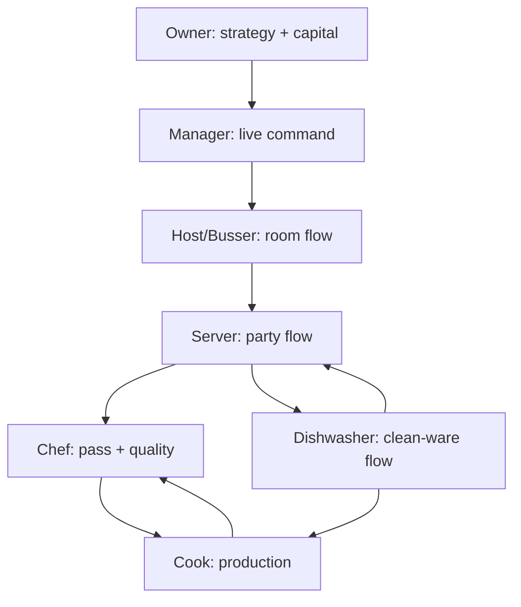
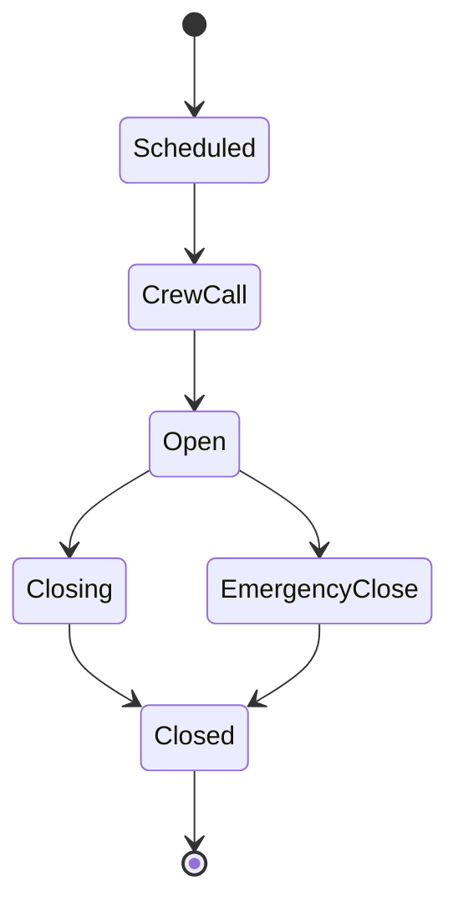

# Rush & Revenue Online

## Continuous Role Gameplay, Minigame Catalog, and Open-Shift Design

**Planning baseline:** 1.1  
**Date:** 2026-07-31  
**Status:** Companion specification to `PRODUCTION_READINESS_AND_ROADMAP.md`

---

## 1. The crew model

A restaurant shift should feel like operating a multi-person vessel. The restaurant is one shared machine, each player has a distinct station and information set, and the crew succeeds through reliable handoffs rather than everyone chasing the same generic alert.

The intended group fantasy is:

- friends assemble a restaurant crew;
- each player clocks into one role for that shift;
- each role has enough authentic, evolving work to occupy that player for the entire service;
- role actions create inputs for other roles;
- failures propagate across stations in legible ways;
- communication and trust produce performance beyond individual minigame scores;
- NPCs fill every vacancy and hand their station to a joining player safely;
- an open restaurant is a public place that regional players can join as employees or customers.

Cross-role interaction remains possible because emergencies are interesting. It is not a workload solution. A Server may put down a wet-floor sign when they are the first person to see a spill; the design must not make the Server wash dishes because the Server ran out of content. The normal answer to an unfilled role is an NPC crew member or a new public employee, not mandatory off-role labor.

### 1.1 Shared operational chain



The arrows are handoffs, not permission walls. Players receive local information and use explicit callouts—`seated`, `fire`, `hold`, `86`, `hands`, `refire`, `behind`, `glass`, `need forks`, `table clear`, `incident contained`—to keep the chain coherent.

### 1.2 One role, one duty station

On clock-in, a player selects an available duty slot. Examples include Server Section A, Grill Cook, Dish Pit 1, Door Host or Floor Manager. A role may have several slots when the physical restaurant and expected demand support them.

A duty slot defines:

- owned room/section/station and work anchors;
- primary queues and dashboards;
- expected handoffs and callouts;
- the NPC that currently covers it, if any;
- allowed join/leave boundaries;
- wage, tip pool and challenge bonus rules;
- role-specific performance evidence.

The character keeps their base class progression, but the duty slot makes immediate responsibility unmistakable.

---

## 2. Continuous engagement without fake busywork

“No time to lean” means **no dead-air role**, not a stream of meaningless clicks. During an open service, every staffed role should have a useful in-role choice available: immediate work, a forecasted setup action, preventative care, paperwork or a tactical improvement.

### 2.1 Four work lanes

Each role dashboard contains four server-derived lanes:

| Lane | Time horizon | Examples |
|---|---:|---|
| Now | Consequence already advancing | Guest signaling, ticket in pickup, rack cycle ended, spill spreading |
| Next | Expected within roughly 30–120 simulated seconds | Table about to finish, pan approaching doneness, clean forks projected to run out |
| Prevent | Low-pressure work that removes future risk | Stage glasses, top mise, inspect a station, polish wares, verify a reservation note |
| Admin | Documentation/planning based on actual world state | Rotation log, comp audit, temperature log, par update, handoff note |

The dashboard does not invent a fake task to fill a bar. It indexes real state and forecasts. Preventative actions have diminishing returns, so the optimal play is not compulsively clicking the same chore.

### 2.2 Role-specific reserve work

When the immediate queue is clear, each role has useful depth:

| Role | Productive low-pressure work |
|---|---|
| Manager | Review forecasts, coach one observed behavior, verify breaks, audit one exception, walk a standard |
| Owner | Review cash runway, compare a vendor/capex option, analyze guest segments, tune a policy, handle a community/VIP contact |
| Server | Pre-read incoming parties, stock section, polish knowledge, consolidate a route, update a regular/handoff note |
| Dishwasher | Stage next rack, detail a machine zone, inspect clean wares, replenish downstream stock, perform preventative maintenance |
| Chef | Line check, taste/quality calibration, review all-day counts, update 86 risk, coach or revise a prep priority |
| Cook | Top mise, rotate product, clean as they go, stage pans/tools, pre-portion an upcoming batch |
| Host/Busser | Recalculate wait, pre-plan table combinations, reset/detail the room, verify reservations, inspect restrooms/entry |

If a duty slot still lacks enough work, the staffing model is wrong. The public shift should offer fewer human slots and leave that duty with an NPC until demand/layout warrants another player.

### 2.3 Staffing-to-workload contract

Before a shift opens, the server estimates role workload from:

- seats, table mix and expected turns;
- menu size, prep complexity and cooking stations;
- service format and Steps of Service policy;
- reservations, walk-in demand and Competitive Dining bookings;
- station capacity and route distance;
- equipment speed/reliability;
- scheduled deliveries, inspections and events;
- expected NPC/player proficiency.

It recommends duty slots and refuses impossible station definitions, such as two Grill Cook slots with one grill interaction zone. Owners may understaff and accept risk. They may not advertise surplus public slots that have no meaningful job.

Normal service should alternate pressure and recovery, but the player should not wait for a progress bar. A role usually has two to five legitimate candidate actions and chooses the best next one.

### 2.4 Task claim and interruption

- Work is visible to its owning duty slots first.
- A player claims a task by beginning travel or accepting it from the queue.
- Teammates see the claim and expected completion, preventing duplicate work.
- Urgent work may interrupt a long task, but interruption has a physical state: a pan remains on heat, an unfinished rack remains dirty, or a guest waits for the Server to return.
- A player can hand off a task explicitly. The receiver must acknowledge it.
- NPCs use the same claim/handoff rules.

This is the source of crew play. A call for “hands” is useful because the pass really is full; the Chef does not spawn a decorative quick-time event.

---

## 3. Production minigame framework

### 3.1 A minigame is a world task

A production minigame is not an isolated modal that pauses the restaurant. It is a focused interaction with live world time, physical prerequisites, an owner role, inputs from other systems, multiple outcomes and downstream evidence.

Every task definition declares:

```text
identity and content-pack version
primary/supporting roles and duty-slot tags
entry conditions and required world objects
world state observed by each phase
phase graph and permitted actions
time, accuracy, safety, waste and hospitality windows
partial failure and interruption states
recovery tasks and escalation rules
NPC policy and proficiency mapping
animation/audio/camera tags
accessibility substitutions
outcome evidence and handoff events
```

The server creates the task instance and owns its seed and state. The client sends choices, gestures and timing samples. The server resolves the outcome. Fixed trivia questions and client-submitted final scores are not production minigames.

### 3.2 Reusable interaction grammars

Variety comes from composing a library of learnable grammars with actual restaurant state.

| Grammar | Core verbs | Best uses |
|---|---|---|
| Observe and diagnose | inspect, compare, test, infer | Quality checks, equipment faults, guest cues, sanitation |
| Contextual dialogue | listen, ask, acknowledge, choose tone, follow up | Greeting, recommendations, recovery, negotiation, coaching |
| Queue orchestration | rank, hold, release, delegate, rebalance | Expo, manager triage, dish pit, seating, prep |
| Spatial packing | orient, group, reserve clearance, balance | Dish racks, trays, storage, table combinations |
| Route and attention | scan, plan stops, move, react | Server circuits, bussing, clean-ware distribution, inspections |
| Precision gesture | cut, pour, scrub, wipe, plate, test | Cooking, cleaning, drink service; never used alone for a whole role |
| Multi-process control | set, monitor, adjust, synchronize | Heat, wash cycles, several tables/courses, utility systems |
| Memory and notation | encode, recall, verify, annotate | Seat orders, modifiers, reservation notes, handoffs |
| Evidence and paperwork | reconcile, sequence, classify, sign | Logs, incident reports, checkout, P&L and rotation |
| Resource tradeoff | allocate, purchase, comp, schedule, reserve | Owner/manager decisions, inventory and labor |
| Construction and flow | place, connect, simulate, revise | Owner building, stations, utilities and table layout |

No role is assigned only one grammar. Mastery means reading harder state and coordinating more processes, not merely making a timing zone narrower.

### 3.3 Difficulty generation

Task difficulty is drawn from live variables:

- current item/guest/equipment state;
- number of concurrent processes;
- station layout and travel;
- menu and service-policy complexity;
- missing, late or ambiguous upstream handoffs;
- fatigue, stress, proficiency and tool quality;
- guest traits, legitimate customer choices and recovery history;
- regional/equipment incidents.

This produces emergent variants. The Dishwasher's rack puzzle contains the actual wares the dining room generated. The Manager's incident report contains the commands and observations from the actual spill. The Cook's timing problem is harder because the Server fired early while another table is held—not because the game selected “Hard Pattern 7.”

### 3.4 Failure and recovery contract

Every task specifies at least:

- one execution error;
- one prioritization error;
- one safe interruption state;
- one recoverable failure;
- one escalation path;
- observable feedback before irreversible consequence where realistic;
- a recovery action owned by the same role or a deliberate crew handoff.

Failing should usually create more role-authentic play. A poor rack is rewashed and deepens the pit queue. A missed two-bite check creates a harder recovery conversation. A bad wait quote creates expectation management. Only safety-critical negligence can jump directly to severe containment.

### 3.5 Mastery and accessibility

Skill changes information, capacity and techniques:

- earlier or clearer cues;
- another concurrent process slot;
- longer safe hold window;
- more precise forecast;
- a batch/shortcut gesture;
- lower material waste or stress;
- expanded authorized recovery options;
- better NPC handoff instructions.

Accessibility assists may slow local gesture presentation, offer hold/toggle alternatives, increase non-color cues, reduce motor precision and read dialogue aloud. Server scoring normalizes approved assists so accessibility is not treated as cheating. Decision complexity can remain even when input precision changes.

---

## 4. Prototype-to-production replacement map

| Current prototype | Production replacement |
|---|---|
| Four Steps of Service timing bars | Twelve contextual, persistent service components plus table-attention routing |
| Generic Cook timing track | Mise planning, prep precision, multi-pan heat, doneness, pickup synchronization and plating |
| Generic Expo timing track | Live ticket rail, call/fire/hold control, plate inspection and refire coordination |
| Six-item dish sorting | Intake triage, soil treatment, rack geometry, machine control, inspection, pit queue and distribution |
| Four fixed party/table matches | Reservation graph, wait forecast, dynamic seating, combinations and live section balance |
| Static 5×5 cleaning coverage | Hazard-specific contain/remove/clean/sanitize/dry/verify tasks on the real floor |
| Three fixed management questions | Live delegation board, labor/break control, guest recovery, audits, inspections and incident command |
| Fixed owner token allocation | Cash-flow, capex, contracts, menu engineering, brand and expansion using the actual business ledger |
| Static paperwork questions | Documents populated from actual shift events, with reconciliation, signatures and downstream effects |
| Four fixed rotation lots | Persistent inventory lots, receiving, labels, storage constraints, pulls, waste and traceability |

---

## 5. Manager duty station

The Manager is the restaurant's tactical commander. Their game is a live operations board plus physical floor presence. They see cross-role risk, but limited attention and authority prevent perfect omniscience.

| Minigame | Moment-to-moment play | Emergent inputs and variants | Failure, recovery and crew effect |
|---|---|---|---|
| Lineup and deployment | Place crew cards into sections/stations, declare priorities, deliver a short dialogue-based briefing | Actual reservations, aptitudes, fatigue, trainees, equipment outages and player roles | Poor assignments create bottlenecks; live reassignment costs disruption but can recover |
| Operations board | Read a layered floor/queue view, rank incidents, delegate and confirm acknowledgements | Every real task age, route congestion, guest risk and staff state; information depends on reports/line of sight | Micromanaging one lane hides another; good delegation gives other players clear goals |
| Seating throttle | Set temporary seating pace/holds by section while negotiating with Host and Chef | Wait queue, ticket rail, table phases, reservations and customer-player arrivals | Over-throttle loses demand; under-throttle floods kitchen; communicate a changed quote to recover |
| Labor and breaks | Fit breaks and station coverage into a moving timeline; respond to late/callout events | Local rules, shift length, demand forecast, staff stress and cross-training | Missed break adds fatigue/compliance risk; swap, shorten service scope or call an open employee |
| Guest recovery | Review evidence, approach guest, listen through contextual dialogue, choose remedy within authority, assign fix and follow up | Actual guest traits, service facts, cost, policy, prior comps and employee account | Generic apology or wrong comp can deepen distrust; ownership/follow-up creates recovery evidence |
| Comp/void control | Match requested exception to ticket/payment evidence and policy; approve, deny or investigate | Actual orders, server notes, kitchen refires, item state, repeat pattern and authority thresholds | Slow approval blocks table; careless approval leaks margin/fraud; audit trail enables later correction |
| Sanitation walk | Physically inspect zones, choose test/tool, identify root cause and assign corrective action | Real dirt, temperatures, logs, route crossings, equipment condition and hidden risks exposed by skill | Treating symptom allows recurrence; containment then root-cause work can prevent inspection finding |
| Incident command | Establish safe zone, stop/continue operations by area, assign first response, notify and monitor | Spill, injury, outage, contamination, fire alarm or guest conflict with live movement and queues | Wrong order raises severity; cross-role callouts and scope reduction recover control |
| Incident reconstruction | Assemble an event timeline from command log, observations, receipts and staff statements; select cause and corrective plan | Only evidence actually generated; accounts may be incomplete or biased by perception | False conclusion creates wrong policy and repeat risk; amended report costs time/reputation but restores accuracy |
| Coaching intervention | Observe a specific repeated error, choose moment/tone, demonstrate or set a focused goal | Player/NPC performance evidence, stress, relationship and current workload | Coaching at peak can distract; a precise low-pressure intervention adds skill progress and reduces recurrence |
| Close control | Reconcile role checklists, cash exceptions, outstanding hazards, labor and handoffs; decide what may roll forward | Entire shift's unresolved state | Premature close leaves cost/safety debt; reopen a task or accept a documented next-day consequence |

Manager mastery adds forecast horizon, delegation slots, authority and clarity. It does not turn the role into a passive buff aura.

---

## 6. Owner duty station

The Owner is the strategic captain. At 4× time, live service produces enough ledger, reputation, vendor, maintenance and capital decisions to support a full role. The Owner can work from an office/hosted dashboard and make hospitality rounds; they are not a substitute Server.

| Minigame | Moment-to-moment play | Emergent inputs and variants | Failure, recovery and crew effect |
|---|---|---|---|
| Cash runway | Reconcile live inflows/outflows, forecast close and choose a reserve/credit response | Actual sales pace, labor, comps, waste, deliveries, debt and upcoming obligations | Spending apparent cash twice triggers shortage; defer, finance or cancel with relationship consequences |
| Capital portfolio | Compare equipment/build projects, place them on a funding timeline and commit construction windows | Layout bottlenecks, wear, quotes, financing, style and expected demand | Expensive power can be stranded by utilities/space; rescope or resell at a loss |
| Vendor negotiation | Read the representative's priorities, trade price/quality/minimum/lead time/payment terms through dialogue | Regional scarcity, history, credit, volume, competing restaurants and seasonal events | Aggressive terms reduce reliability/relationship; accept bridge supply or rebuild trust |
| Purchase authorization | Review forecast and department requests, consolidate pack sizes, choose substitutions and delivery window | Persistent inventory lots, storage capacity, recipe forecast and cash | Overbuy causes spoilage/storage congestion; specials, transfer or waste recovery |
| Menu engineering | Place items by contribution/popularity, inspect guest segments, revise price/position/spec with Chef input | Real recipe costs, cook capacity, reviews, sales mix, vendor changes and concept promise | Removing a draw item harms demand; limited test period and communication can recover |
| Brand watch | Interpret live guest evidence and choose service/decor/community response | Review dimensions, customer personas, theme coherence, promises and staff behavior | Chasing every complaint muddies identity; commit to a segment and measure a controlled change |
| Policy desk | Set comp limits, reservation/deposit rules, uniforms, tip pool and service standards within constraints | Staff sentiment, region norms, guest mix, law/compliance and financial impact | Poor policy causes turnover or guest friction; consult crew and phase change to recover |
| Maintenance portfolio | Rank inspections/repairs/replacements while equipment continues to wear | Failure probability, part lead time, redundancy, service windows and cash | Deferred item fails in service; rent emergency gear, trim menu or expedite part |
| Community/VIP hosting | Pre-read a visitor, choose recognition and commitment through dialogue, then track fulfillment | Regular history, local organizations, critics, events and actual service state | Overpromise creates public disappointment; honest expectation reset can preserve trust |
| Insurance/lease response | Inspect clauses and evidence, assemble a response package, choose settlement/renewal tradeoffs | Actual incident history, build condition, revenue and regional lot market | Missed evidence worsens terms; corrective project and documented controls improve renewal |
| Site and expansion | Compare lots on demand, labor, logistics, lease and build constraints; sketch a viable concept | Living regional pools and competitor closures/openings | Expansion without runway threatens both units; delay, partner, sell or enter receivership plan |

Owner decisions have delayed consequences, but the UI previews assumptions and schedules follow-up checks. The role's skill lies in forming and revising a thesis, not guessing opaque future dice.

---

## 7. Server duty station

The Server owns several simultaneous party timelines. Their continuous game is attention allocation across the Steps of Service; individual components use different mechanics.

| Minigame | Moment-to-moment play | Emergent inputs and variants | Failure, recovery and crew effect |
|---|---|---|---|
| Party pre-read | Scan reservation/host notes, infer likely pace and set a short memory plan | Occasion, accessibility, customer persona, regular history, section workload and incomplete notes | Missed note lowers trust or safety margin; confirm politely before commitment |
| Contextual greeting | Choose approach moment, position, tone and information order in branching dialogue | Conversation state, wait experience, concept, party mood and nearby interruptions | Interrupt/overload/ignore; acknowledge wait or re-approach to recover |
| Beverage discovery | Ask preference questions, match recommendation and remember seat/modifier | Menu stock, guest taste, budget, pace, age/policy and customer challenge choices | Poor fit harms value; clarify or offer taste where policy permits |
| Pour and setup | Select glass/setup, control pour/placement and navigate interruption | Vessel, beverage, table space, tray load, congestion and equipment quality | Overpour/spill/wrong glass; contain, replace and update check |
| Menu interview | Answer ingredient/technique questions and narrow recommendations through dialogue | Actual recipes, 86s, allergies, Chef changes, guest history and value expectation | Bluffing creates severe evidence; pause and verify with Chef safely |
| Seat-numbered order | Encode item, modifiers, course and seat on a visual table map; confirm ambiguous speech | Party movement, split intentions, menu structure and interruptions | Wrong seat/modifier; read-back and pre-fire correction avoid production waste |
| Allergy confirmation | Trace declared need through ingredients, modifier feasibility, POS marker and verbal handoff | Recipe/allergen graph, kitchen load, substitution and certification | Uncertain order cannot fire; Manager/Chef confirmation is required rather than a risky guess |
| Course conductor | Choose send/hold/fire moments while tracking guest pace and pass state | Live ticket queue, table behavior, cook estimate, service standard and turn pressure | Early food waits; late guests wait; coordinate hold/refire/expectation update |
| Tray build and route | Pack items by weight/stop, choose route and physically carry with adaptive balance | Actual dishes, spills, doors, crowding, skill, furniture path and guest movement | Drop/wrong stop; call hands, re-route, contain and refire as needed |
| Delivery and seat match | Place each item to seat, name/confirm critical item and avoid auctioning | Seat changes, modifiers, low light, table clutter and party conversation | Wrong dish/seat creates correction and food-quality loss; fast recognition earns recovery |
| Two-bite check | Observe eating/body cues, select the right moment and diagnose with contextual questions | Food evidence, guest trait, conversation, prior trust and customer persona | Generic/late check misses recovery window; Manager escalation remains possible |
| Attention circuit | Scan tables, choose a multi-stop route and perform refills, pre-bus and silent needs | Every table phase, route, interruption, low stock and teammate claims | Tunnel vision causes cascading needs; delegate/call Busser and communicate delay |
| Recovery conversation | Listen without skipping, name issue, choose authorized remedy, coordinate fix and return | Actual error evidence, guest goal, cost, authority and previous attempts | Wrong remedy or no follow-up converts problem to review; Manager handoff can recover |
| Dessert/check read | Infer readiness, offer without pressure and time check presentation | Pace, celebration, budget, turn need and guest cues | Rushing harms hospitality; delayed check harms timing; acknowledge and expedite |
| Split and payment | Visually assign items/tax/tip rules, process tenders and reconcile change/receipts | Seat moves, shared items, multiple tenders, discounts and connection faults | Misallocation/payment lock; Manager audit and correction preserve trust at time cost |
| Checkout/handoff | Reconcile checks/tip-out, complete meaningful side work and leave notes for relief | Actual section state, cash, open checks, regular notes and upcoming reservations | Hidden open state burdens next player; corrected checkout delays clock-out but protects reliability |

The Server HUD never becomes twelve separate pop-up bars. It is a table-state workspace with contextual focused interactions and a physical character who must move through the room.

---

## 8. Dishwasher duty station

The Dishwasher controls a closed-loop material network. Dirty wares arrive unpredictably; clean wares are demanded by specific stations. The machine is not an automatic timer—it is one resource inside a spatial and chemical flow game.

| Minigame | Moment-to-moment play | Emergent inputs and variants | Failure, recovery and crew effect |
|---|---|---|---|
| Intake triage | Pull dirty stacks, identify sharps/fragile/material/soil and choose scrape/soak/rack lanes | Actual dishes returned by tables/kitchen, breakage, allergen/soil and pit capacity | Hidden sharp injures/delays; stop, contain, report and reorganize intake |
| Scrape and waste sort | Use efficient gesture path to clear food while separating compost/trash/utensils | Food type, local waste policy, bin fullness and disposal equipment | Clogged rack/mis-sorted waste adds cost; re-sort or clear machine filter |
| Soil treatment | Diagnose baked-on, grease, dairy, starch or lipstick and choose temperature/tool/soak | Time since use, material, chemical supply and downstream urgency | Wrong treatment damages ware or wastes time; change method before full cycle |
| Rack geometry | Rotate/place actual ware to preserve spray paths, drainage and fragility separation | Changing object footprints, urgent ware demand, rack type and machine nozzle map | Nesting/shielding causes dirty inspection; re-rack and rewash deepens queue |
| Machine setup | Test temperature/concentration/pressure, adjust safe controls and verify | Utility supply, chemical lot, maintenance, ambient load and machine tier | Unsafe cycle quarantines output; correct setup, document and rerun |
| Cycle cadence | Feed/unload around machine cycle while managing pre-soak and dry capacity | Rack queue, machine speed, clean landing room, interruption and wear | Idle machine or blocked landing collapses throughput; stage/reprioritize |
| Clean inspection | Rotate/inspect sampled wares under light; identify soil, chips and chemical film | Actual wash outcome, material, machine state and skill | Passing dirty ware creates guest/kitchen evidence; recall batch and diagnose cause |
| Pit priority board | Rank racks against projected shortages and soil-age risk | Live requests for plates, pans, glasses, cutlery and prep tools | Wrong priority starves another role; communicate shortage and run emergency rack |
| Clean distribution | Load cart/rack, choose route and replenish stations without contaminating clean flow | Layout, route crossings, current par, crowding and object weight | Clean ware placed dirty/wrong station; quarantine or reroute before use |
| Pots and specialty ware | Choose manual tools, soak and abrasion pattern while protecting finish | Carbon, knives, cast iron, nonstick, glass and chef urgency | Damage/slow return changes production; Chef negotiates substitute equipment |
| Breakage containment | Stop lane, protect area, remove pieces by size/material, inspect surrounding items and log | Location, glass type, food/ice exposure and guest proximity | Missed shard escalates safety; widen quarantine and discard exposed product |
| Preventative maintenance | Inspect arms/filter/seals/scale, disassemble safe parts, clean and test | Wear, water hardness, cycle evidence and part supply | Incorrect assembly reduces wash quality; troubleshoot or call service |
| Pit close | Drain/clean machine, clear traps, reconcile chemicals/breakage, stage opening pars | Entire shift's residue and unresolved maintenance | Incomplete close starts next day degraded; document carryover or finish overtime |

Dishwasher skill expands simultaneous flow and diagnosis. It never turns the role into a single repeating sorting puzzle.

---

## 9. Chef duty station

The Chef owns kitchen truth: what can be sold, what is safe, when food is fired, whether it meets spec and how the brigade responds.

| Minigame | Moment-to-moment play | Emergent inputs and variants | Failure, recovery and crew effect |
|---|---|---|---|
| Line check | Walk stations, sample mise/equipment/logs, compare to demand and assign corrections | Actual lots, pars, temperatures, station skill, reservations and wear | False ready state fails at rush; trim menu, expedite prep or delay seating |
| Ticket rail | Arrange live tickets by course/table/dependency while preserving promises and allergies | Server fires, holds, customer modifiers, station capacity and ticket age | Bad rail order creates split pickups; re-sequence with clear calls |
| Call and acknowledgment | Issue concise fires/holds/all-day counts, listen for acknowledgments and resolve conflicts | Human/NPC Cook status, noise, equipment failure and changing counts | Unacknowledged call becomes ambiguity; repeat/confirm without flooding comms |
| Pickup orchestration | Align station components into a narrow pass window and call hands | Real component estimates, rests, holds, plate availability and server distance | One component dies waiting; replace/hold whole table/adjust promise |
| Plate inspection | Inspect temperature, doneness, portion, modifier, garnish and vessel against spec | Actual Cook output, lighting, recipe version, allergy status and rush pressure | Bad pass reaches guest; catch/refire costs time but protects safety/reputation |
| Taste calibration | Compare flavor/texture signals, identify cause and issue a measured correction | Ingredient lot, reduction, salt/acid/heat, palate skill and batch size | Overcorrection wastes batch; repurpose, dilute or remake |
| Refire and recovery | Diagnose source, choose remake path, protect other tickets and communicate estimate | Specific defect, station load, guest tolerance, product and Server recovery | Hidden refire floods line; explicit priority and adjusted fires recover flow |
| 86/substitution control | Forecast remaining portions, verify lots and publish availability/substitution | Sales pace, waste, yield, delivery, customer orders and owner policy | Late 86 breaks promises; substitute, comp or simplify menu with clear announcement |
| HACCP decision | Inspect time/temperature/contamination chain and choose safe disposition/control | Persistent lot/task history, equipment outage and logs | Unsafe guess can shut station; discard/contain/document and redesign process |
| Yield and order guide | Convert forecast portions into purchase/prep quantities using usable yield | Recipe specs, trim history, demand, pack sizes and vendor supply | Short/over order affects days; specials, preservation or emergency sourcing |
| Waste review | Match waste to prep, defects, returns and spoilage; choose a process experiment | Actual waste events and responsible causes | Blame harms crew; correct root cause improves cost and morale |
| Kitchen coaching | Observe a repeated station behavior, demonstrate/call a technique and set feedback point | Cook traits, stress, task replay and current service risk | Bad timing undermines station; post-rush follow-up recovers learning |

Chef play alternates live expo intensity with line inspection, safety, yield and leadership. The Chef should never wait for the next generic timing bar.

---

## 10. Cook duty station

The Cook is a multi-process craft role. Station choice changes the recipe set and equipment, while the common class rewards mise, heat, timing, safety and communication.

| Minigame | Moment-to-moment play | Emergent inputs and variants | Failure, recovery and crew effect |
|---|---|---|---|
| Product pull/rotation | Inspect lot labels/quality, select FIFO/FEFO pull and place in safe station storage | Actual delivery lots, allergens, thaw state, shelf life and station par | Wrong pull causes spoilage or outage; re-label/quarantine/replan prep |
| Mise dependency plan | Arrange prep tasks by dependency, equipment conflict, shelf life and deadline | Forecast tickets, staffing, existing batches, utilities and Chef priorities | Attractive but wrong order leaves critical component missing; reprioritize or 86 |
| Knife/prep craft | Control cut path, hand position, orientation and batch rhythm for consistent yield | Ingredient geometry/quality, tool sharpness, target cut and fatigue | Inconsistent cuts cook unevenly; reclassify use, recut or adjust cook plan |
| Batch scaling | Convert recipe yield, stage measured ingredients and sequence additions | Actual needed portions, container limits, unit systems and ingredient strength | Scaling/sequence error changes whole batch; diagnose, rebalance or discard |
| Station setup | Place pans/tools/mise in reachable anchors and preheat/calibrate equipment | Physical workstation, handedness option, menu mix and equipment tier | Poor setup adds travel/crossing; pause to reset before peak |
| Multi-pan heat control | Start, move, turn, baste and rest concurrent components across heat zones | Real orders, pan/equipment behavior, product thickness, interruption and Chef holds | Burn/undercook/overcrowd; move zones, finish alternate method or refire |
| Doneness and sensory read | Combine time with visual/touch/temperature cues and select remove/rest point | Cut variability, carryover, guest request, thermometer/tool and skill | Wrong doneness detected at pass/guest; refire and update timing model |
| Modifier/allergy lane | Create a protected workflow, select clean tools/mise and verify ticket steps | Actual allergen graph, station contamination, concurrent regular tickets | Broken chain forces discard/clean restart; never solved by accepting a score penalty |
| Pickup synchronization | Pace components to Chef's call, acknowledge holds and expose ETA/risk | Other stations, course state, pass congestion and live refires | Silent delay harms entire table; early callout enables Chef/Server recovery |
| Plating assembly | Place actual components in dependency/order, control portion and clean rim | Recipe spec, plate type/temp, modifier, rush and object placement | Missing/wrong garnish/portion; inspect and correct before pass |
| Clean as you go | Identify safe micro-windows, clear tools, sanitize transitions and reset anchors | Station queue, soil/allergen type, chemical/tool availability | Ignored debt reduces space and safety; planned reset restores capacity |
| Equipment anomaly | Diagnose heat/power/noise/smell changes, choose safe continuation/shutdown and communicate | Wear state, maintenance, utility event and product in process | Unsafe continuation escalates damage; transfer product or trim menu |
| Station handoff/close | Reconcile lots, prep, hot/cold state, waste, tools and notes with relief/next shift | Entire live station state | Hidden shortage surprises next player; accurate handoff improves crew continuity |

Station specializations add recipe/equipment grammar, not isolated new classes of progress bars.

---

## 11. Host/Busser duty station

Host/Busser owns the public boundary and physical dining-room readiness. The role alternates a predictive table graph with movement, guest dialogue, cleaning and resets.

| Minigame | Moment-to-moment play | Emergent inputs and variants | Failure, recovery and crew effect |
|---|---|---|---|
| Reservation graph | Fit bookings into compatible table/time nodes and protect combinations/accessibility | Actual floor plan, party needs, duration history, VIP/customer players and deposits | Overbook creates wait conflict; contact/reseat/comp plan can recover |
| Wait forecast | Estimate table completion + payment + bus/reset + seating while accounting for priorities | Live Steps of Service, Server pace, Busser workload, reservations and table types | Bad quote damages trust; proactive update and option dialogue reduce harm |
| Arrival dialogue | Recognize booking/walk-in, clarify needs, set expectation and place in fair queue | Party traits, prior quote, accessibility, celebration and customer persona | Cold/wrong expectation starts negative evidence; ownership and accurate update recover |
| Seating graph | Choose party-table-section match against fairness, capacity, pace and future combinations | Physical tables, server load, kitchen throttle, walk-ins and reservation deadlines | Double-seat floods section; delay/redistribute with communication |
| Escort and handoff | Select clear route, pace group, handle obstacles and deliver concise party notes to Server | Crowding, mobility, children, highchairs, spill zones and table state | Lost/unready table causes embarrassment; redirect and reset expectation |
| Table combine/split | Move/lock modular tables and covers while preserving aisles, egress and upcoming bookings | Real furniture weight/footprint, party size, staff route and time | Bad combination blocks path/loses inventory; reconfigure before seating |
| Dining-room scan | Read visible cues across tables/entry/restroom and choose an efficient support circuit | Dirty states, low water, guests standing, spills, server claims and queue | Focusing only on turns lets cleanliness/guest needs decay; call/claim priorities |
| Pre-bus circuit | Plan stops, request permission through cue/dialogue, sort and carry items without disrupting service | Table phase, object stack, route, guest conversation and dish-pit demand | Premature/awkward clear harms hospitality; apologize/return item if possible |
| Bus-tub/stack balance | Pack actual ware by weight/fragility/soil, navigate and unload into dish intake lanes | Table output, tub/rack quality, route congestion and sharps | Drop/break/mix creates hazard and pit delay; contain and communicate |
| Reset sequence | Clear, clean, sanitize, dry, align furniture and set concept-specific cover; final inspect | Spill/soil type, table material, next party needs, linen/ware availability | Incomplete/wet/wrong cover delays seat or creates cleanliness evidence; rework/call shortage |
| Spill containment | Place protection, identify hazard, choose tools, remove/clean/sanitize/dry/verify and remove sign | Actual liquid/debris, surface, spread, traffic and guest proximity | Wrong method spreads/slips/damages floor; widen zone and request Manager/Dish support |
| Restroom/entry standard | Inspect a real checklist through observation, replenish and document high-risk condition | Guest traffic, supplies, fixtures, odor/water and previous inspection | Cosmetic wipe misses cause; close fixture/area, clean and report maintenance |
| Closing room | Route through furniture, floors, stations and lost property; assign next-day issue | Entire room's accumulated state | Unfound item/hazard persists; documented escalation protects next shift |

Host and Busser may later split into separate subclasses or duty roles without changing the base task tags.

---

## 12. Paperwork is operational gameplay

Paperwork must never be a fixed multiple-choice quiz wearing a clipboard skin. A document is a view over real records and creates a signed decision.

Examples:

- a cooling log references an actual batch, recorded temperatures and time gaps;
- a rotation sheet references inventory lots physically placed in storage;
- a comp audit references the ticket, guest evidence, authorization and payment;
- an incident report references positions, commands, observations and injuries;
- a prep/par sheet changes tasks and purchase forecasts;
- a close report transfers unresolved work to the next day;
- a P&L reconciles actual ledger lines and flags unusual variance.

Good paperwork can reveal a hidden trend or certify a safe state. Incorrect paperwork can conceal a problem temporarily, but the underlying world record still exists and may be discovered in an inspection/audit. Deliberate falsification is a serious action with explicit confirmation, not an accidental wrong click.

---

## 13. Crew handoffs and communication

### 13.1 Handoff contracts

| Producer | Handoff | Receiver | Completion evidence |
|---|---|---|---|
| Host/Busser | Party seated, needs, wait history, section | Server | Server acknowledges table and pre-read updates |
| Server | Seat order, modifiers, allergies, course policy | Chef | Ticket accepted or clarification requested |
| Chef | Fire/hold/all-day/86 and station work | Cook | Cook acknowledgment and ETA/risk |
| Cook | Component ready/late/defect | Chef | Pass receives, holds or refires |
| Chef | Hands call, plate identity and priority | Server | Correct Server claims and delivers |
| Server/Busser/Cook | Dirty ware and urgent shortage context | Dishwasher | Intake route and pit priority update |
| Dishwasher | Clean ware replenished/short/unsafe batch | Receiving station | Station par or shortage state updates |
| Any role | Incident observation/request | Manager | Delegation, containment or explicit monitor decision |
| Chef/Manager | Capital, vendor or policy exception | Owner | Owner decision and communicated consequence |

### 13.2 Communication interface

Use fast contextual callouts plus optional voice/text:

- a radial/keyboard callout references the selected task, ticket, table or station automatically;
- acknowledgments are one action and visible to the sender;
- the system records important callouts for task authority and replay;
- NPCs understand the same structured messages;
- players can mute social channels without losing operational callouts;
- role-specific vocabulary is introduced by tutorials and subtitles.

Good communication improves state knowledge; it is not a cosmetic emote bonus.

---

## 14. Public open shifts

### 14.1 World rule

When a restaurant enters the economically active **Open** state, it appears in its region's Live Shifts directory. Subject to physical capacity and role slots:

- any regional player may join the guest queue;
- any player who has completed the relevant role orientation may claim an open employee duty slot;
- friends and permanent employees may reserve crew slots for a short pre-opening grace period;
- unclaimed duty slots are covered by NPCs;
- when the grace period expires, vacancies become public Open Call slots;
- a truly private rehearsal is a separate **Practice** state and does not generate normal public demand, ratings or competitive rewards.

“Open to anyone” does not mean infinite copies or unlimited bodies. The restaurant has one authoritative active instance, physical tables and valid workstation slots. A full restaurant uses a queue/waitlist rather than cloning the business.

### 14.2 Shift lifecycle



| State | Join behavior |
|---|---|
| Scheduled | Crew/friends can reserve duty slots; guests can reserve future tables |
| Crew Call | Reserved employees clock in; missing slots show as public Open Calls; NPCs begin setup |
| Open | Employees can join vacancies and guests can join queue continuously |
| Closing | No new walk-ins; replacement employees join only if a critical vacancy remains; seated guests finish |
| Emergency Close | No new joins; current people receive clear safe-exit/settlement flow |
| Closed | Reports, build mode and applications; no active public service |

### 14.3 Live Shifts directory

From the region view, each open listing shows:

- restaurant, concept, rating dimensions and service style;
- real minutes remaining and current service intensity;
- guest queue, estimated wait and Competitive Dining mode;
- employee duty slots by role/station;
- minimum orientation/certification, if safety-relevant;
- expected wage, tip range and challenge bonus—not a guaranteed result;
- role workload forecast: steady, busy, peak or recovery;
- party/crew friend presence and connection quality;
- active incidents only when publicly observable, never hidden operational information.

The same restaurant card has two primary actions: **Join as Employee** and **Visit as Guest**.

### 14.4 Employee entry paths

The original job application system remains valuable, but it is not allowed to block drop-in crew play.

| Relationship | Entry | Benefits |
|---|---|---|
| Permanent employee | Accepted application and scheduled/reserved slot | Priority shifts, progression relationship, training, benefits/policy access |
| Friend crew | Temporary crew reservation before open | Guaranteed short grace period and coordinated starting station |
| Open Call employee | Claims a public vacancy during Crew Call/Open | Immediate role play, standard wage/tips, reliability record, path to application |
| Trainee | Claims a labeled supervised slot | Restricted safety actions, guided tasks and orientation progress |
| NPC relief | Automatic whenever no human owns a required slot | Same task system, clean handoff when a player arrives |

Every player can access an Open Call after completing a short role orientation. Restaurants cannot require arbitrary power ratings for ordinary public shifts. They may expose concept-specific certifications where the work genuinely changes, such as alcohol service or advanced allergy protocol.

### 14.5 Join-in-progress handoff

Joining an active role is an operational event:

1. The server reserves the duty slot briefly and sends the restaurant snapshot.
2. The player sees a ten-to-twenty-second interactive briefing: station, immediate queue, critical incidents, 86s, handoffs, breaks and local controls.
3. The character spawns at the staff entrance/clock point.
4. The current NPC continues until the player reaches the station or acknowledges the handoff.
5. The NPC finishes or safely parks its active task and transfers claims/state.
6. The player confirms “I have the station”; crew dashboards update.

No pan is abandoned on heat and no guest loses a Server because a network join occurred.

### 14.6 Leaving and disconnects

- Players choose 15-, 30- or 60-minute commitment blocks within the remaining shift, with 60 minutes recommended.
- A clock-out request opens a handoff task and public replacement call.
- At a safe boundary, an NPC or waiting player assumes the station.
- Unexpected disconnect grants a short reconnection shadow; the NPC takes control immediately where safety demands it.
- Earned wage/XP settles proportionally from authoritative task/attendance evidence.
- Repeated intentional crisis abandonment affects a reliability indicator, but emergency disconnects are not punished aggressively.

### 14.7 Friends as a full crew

A crew leader can assemble a roster before service, invite friends into named duty slots and ready the group. When the restaurant opens:

- reserved players receive the same physical clock-in/lineup;
- unfilled slots immediately show as public vacancies and have NPC coverage;
- extra friends may join as guests, take another valid duty slot or waitlist;
- the crew can remain together across future scheduled shifts without creating an exclusive private copy of the public restaurant.

This supports a seven-friend roster—Owner, Manager, Server, Dishwasher, Chef, Cook and Host/Busser—while larger restaurants can add multiple Server, Cook, Dish and Busser duty slots.

### 14.8 Guest entry

A guest player may enter solo, join a party, form a friend party or reserve Competitive Dining. They wait in the real host queue and occupy a real table. If the restaurant has no human staff, NPCs operate every role. If staff players join during the meal, they inherit a fully simulated service already in progress.

Guests cannot see staff-only queues, hidden cleanliness or exact patience values. They experience observable service and use contextual customer actions. Their bill is a real money sink and their review is evidence-based.

### 14.9 Public-shift safeguards

- The server validates every inventory, comp, void, build and payment action.
- New Open Call employees lack destructive capital/ledger permissions.
- Managers can remove a disruptive player from a duty station, but the reason and replay are logged; the NPC immediately covers it.
- A removed employee keeps legitimate earned pay and can appeal/report abuse.
- Matchmaking can avoid blocked accounts without allowing owners to secretly curate only favorable reviewers.
- Guests and employees have structured reporting, mute and moderation tools.
- Public restaurant rating never depends on a manually typed star score.

---

## 15. Open-shift capacity and balance

### 15.1 Human slot formula

A duty slot exists only when all are true:

1. a physical station/section supports it;
2. forecast work can keep it meaningfully engaged;
3. crew handoffs will not create duplicate authority;
4. server/client entity capacity remains in budget;
5. the restaurant can afford its wage policy.

Examples:

- one small six-table restaurant may support one Host/Busser, one Server, one Cook, one Chef/Expo, one Dishwasher, one Manager and an optional active Owner;
- a larger room may support three Server sections, two Cook stations, a dedicated Host and Busser slots, and two Dish lanes;
- adding a second grill alone does not add a second Cook slot if prep, pass or demand cannot feed it.

### 15.2 Admission and intensity

The Host/Manager control ordinary seating pace, but regional demand, reservations and live customers create pressure. The game should not manufacture parties solely to occupy excess staff. Instead:

- recommend crew size from forecast;
- expose public vacancies only for valid work;
- let NPCs cover marginal roles cheaply at low demand;
- let owners advertise promotions or Competitive Dining windows ahead of time;
- allow a quiet shift to focus on prep, deep standards, training and business work with real future payoff.

“Always engaged” does not mean “always at maximum APM.” It means the player can make a valuable in-role choice without waiting or abandoning their station identity.

---

## 16. Skill trees and continuous role play

The 28-node base trees in the production roadmap must support four types of growth:

1. **Throughput:** handle more simultaneous state or execute a known process efficiently.
2. **Perception:** notice earlier, remember longer or diagnose more precisely.
3. **Recovery:** gain additional safe responses when something goes wrong.
4. **Crew interface:** improve handoffs, callouts, coaching or NPC delegation.

Each branch must modify at least three distinct minigames. A tree that only buffs one signature puzzle will not sustain a full shift.

Examples:

- Server `Tablecraft` adds another remembered seat map, improves route chaining and unlocks silent-service gestures.
- Dishwasher `Rack Flow` reveals projected ware shortages, adds rack grouping and reduces unload transition time.
- Cook `Rush Tempo` allows a safe verbal ETA while continuing heat control and improves recovery after a hold.
- Host/Busser `Doorcraft` gives a confidence band on wait forecasts and a new expectation-reset dialogue move.
- Manager `Flow Control` extends forecast horizon and lets one delegation persist through an interruption.
- Owner `Capital` improves quote comparison and unlocks a bridge-financing response, but still requires cash discipline.
- Chef `Expo` preserves another ticket relationship and enables a coordinated whole-table hold.

Subclass packs add a fourth gameplay emphasis without invalidating the base duty station. A Beverage Steward still owns Server handoffs; a Pastry Cook still participates in production/pickup; a Turnover Captain still belongs to the Host/Busser room-flow game.

---

## 17. Acceptance criteria

The continuous-role/open-shift system is ready for production testing only when:

- seven human players can occupy the seven base roles in one restaurant for a 60-minute shift;
- every role has useful in-role work throughout normal service and uses at least four interaction grammars;
- no role must perform another role's task to avoid dead air;
- NPCs seamlessly fill every empty slot and hand it to a joining player without losing task state;
- friends can reserve a crew, open the restaurant, and have vacancies become public;
- a regional stranger can join a vacancy, complete a briefing and contribute within two minutes;
- a regional stranger can join the guest queue and receive a fully simulated visit;
- an employee can leave safely and the restaurant continues;
- each listed minigame consumes actual world state, has partial failure and creates downstream evidence;
- paperwork references the shift's real records rather than a static answer bank;
- a single failure can cross several roles through explicit handoffs without becoming an unavoidable wipe;
- server replays reproduce the result and reject client-authored scores/rewards;
- players can identify their owned, supporting and unavailable interactions before clicking;
- one-hour playtests show meaningful role progression and a completed shift payoff without requiring a four-hour commitment.

The core playtest question is simple:

> If every other human stayed in their assigned job, did each player still have a full game to play, and did the restaurant feel like one coordinated machine?

Until the answer is consistently yes, adding more regions or cosmetic packs is not the priority.
